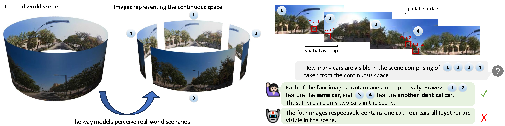

# CoSpace: Benchmarking Continuous Space Perception Ability for Vision-Language Models



## Quick Start

### Installation

All the images for **CoSpace** can be downloaded from [Hugging Face](https://huggingface.co/datasets/StephenZhu/CoSpace/). After successfully downloading the images, please keep the directory as follows:

```bash
src/
├── data/
│   ├── anno/
│   │   ├── direction.jsonl
│   │   ├── object.jsonl
│   │   └── ...
│   │
│   └── images/
│       ├── panorama_images/
│       ├── habitat_scenes/
│       ├── frames_30/
│       └── frames_45/
│
├── pipeline/
│   ├── scripts/
│   │   ├── pred_gpt.py
│   │   ├── pred_claude.py
│   │   └── ...
│   │
│   ├── pred.sh
│   ├── pred_and_eval.sh
│   ├── load_data.py
│   ├── prompt.py
│   ├── eval.py
│   └── utils.py
│
└── pipeline-single/
    └── ...
```

### Evaluation

To evaluate on our **CoSpace**, you can directly run the provided scripts:

```bash
# Prediction
bash pred.sh

# Prediction and evaluation
bash pred_and_eval.sh

# Also, you can directly evaluate the prediction file
python eval.py --data_file path_to_the_prediction_file --save_dir result_save_directory
```

To evaluate a new model, please add your `pred_{your_model}.py`, and modify the `eval.py` to fit the output format.