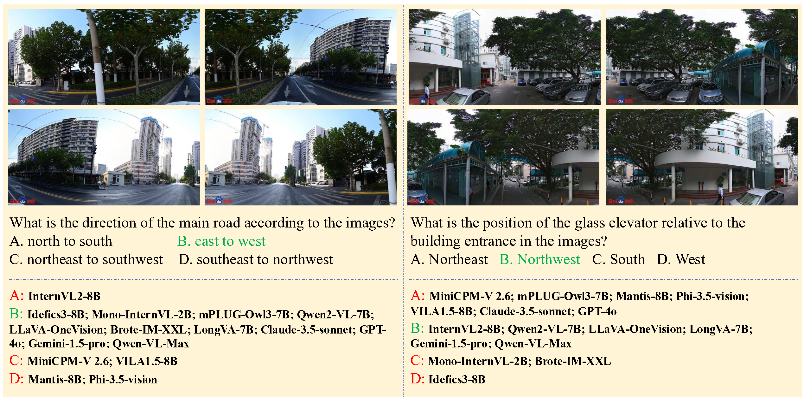
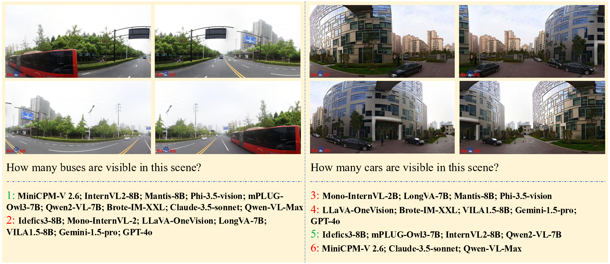
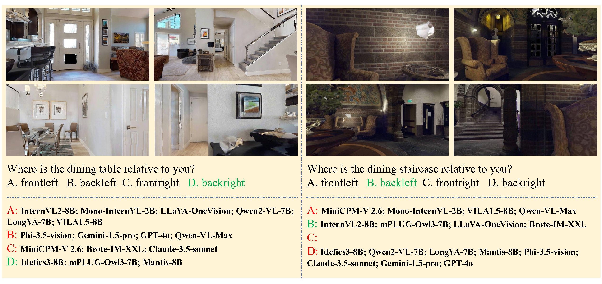

<head>
  
</head>

<strong>
    CoSpace: Benchmarking Continuous Space Perception Ability for Vision-Language Models
</strong>

 

    Yiqi Zhu1*,
    Ziyue Wang1*,
    Can Zhang3,
    Peng Li2†,
    Yang Liu1,2

 

    1 Department of Computer Science and Technology, Tsinghua University 
    2 Institute for AI Industry Research (AIR), Tsinghua University 
    3 School of Computer and Communication Engineering, University of Science and Technology Beijing 

 

    * Equal Contribution 
    † Corresponding Author 

 

  <a href="" target="_blank"><strong> <i class="fas fa-file-pdf"></i> arXiv</strong></a> |
  <a href="https://github.com/THUNLP-MT/CoSpace" target="_blank"><strong> Github</strong> <i class="fab fa-github"></i> </a>

  Paper is now under review and will be available soon.

 

    

 

<strong>
    Abstract
</strong>

Vision-Language Models (VLMs) have recently witnessed significant progress in visual comprehension. As the permitting length of image context grows, VLMs can now comprehend a broader range of views and spaces. Current benchmarks provide insightful analysis of VLMs in tasks involving complex visual instructions following, multi-image understanding and spatial reasoning. However, they usually focus on spatially irrelevant images or discrete images captured from varied viewpoints. The compositional characteristic of images captured from a static viewpoint remains underestimated. We term this characteristic as <b>Continuous Space Perception</b>. When observing a scene from a static viewpoint while shifting orientations, it produces a series of spatially continuous images, enabling the reconstruction of the entire space. In this paper, we present CoSpace, a multi-image visual understanding benchmark designed to assess the <b>Co</b>ntinuous <b>Space</b> perception ability for VLMs. CoSpace contains 2,918 images and 1,626 question-answer pairs, covering seven types of tasks. We conduct evaluation across 16 proprietary and open-source VLMs. Results reveal that there exist pitfalls on the continuous space perception ability for most of the evaluated models, including proprietary ones. Interestingly, we find that the main discrepancy between open-source and proprietary models lies not in accuracy but in the consistency of responses. We believe that enhancing the ability of continuous space perception is essential for VLMs to perform effectively in real-world tasks and encourage further research to advance this capability.

 

<strong>
    Task Design
</strong>

    

<strong>
    Direction Recognition (DIR-Rec)
</strong>

In real world, identifying direction is inevitable when one is placed in a new environment. Similarly, the DIR-Rec task requires models to recognize the direction of targets by answering questions such as <i>"where is the building located?"</i> Meanwhile, we provide detailed task instructions, including direction references such as <i>"the first image is facing north, the second image is facing east"</i>. We standardize 8 directional options, including four cardinal directions, North, East, South and West, and four intercardinal directions, Northeast, Southeast, Southwest, and Northwest.

<strong>
    Directional Object Perception (DIR-Obj)
</strong>

Some real-world tasks demand abilities far beyond merely identifying the direction of a specified target. It is also a critical ability to distinguish content regarding different directions and to align objects with correct directions. Given a specified direction, the DIR-Obj task requires models to be aware of the appearing objects, and also distinguish those absent from that direction. To achieve this, models need to first reconstruct the entire space from continuous views, and then correctly identify the objects dedicate to a given direction. Specifically, in this task, questions typically focus on the intercardinal directions such as <i>"What is visible in the southeast direction?"</i>, which necessitates a more comprehensive understanding of the entire space.

<strong>
    Rotation-Angle (ROT-Ang)
</strong>

For an observant, when rotating the perspective for more spatial information, there could be overlaps between adjacent observations. Specifically, human can tell the approximate turning angle between consecutive images observed from a static viewpoint by noticing identical furnishings appearing across images. In this task, we investigate if models exhibit similar ability as human does, which requires fine-grained continuous spatial understanding. We apply unified question <i>"What is the turning angle between the adjacent image?"</i> and provide two candidate options for model. This task requires models to carefully exam the overlapping and different areas between adjacent images and the shared features in spatially continuous image sequence.

<strong>
    Rotation-Difference (ROT-Dif)
</strong>

Following the ROT-Ang task, we also investigate the model ability to identify distinguished rotation angles. For the ROT-Dif task, models are given a sequence of five images, four of which share the same turning angle and the other is exceptional. Compared to ROT-Ang, this task emphasizes more on the global understanding of images regarding continuous visual space. The unified question of this task is <i>"Which image does not belong to this image sequence?"</i> It is an open-ended question without options, where models are required to answer with index of the exceptional image.

<strong>
    Counting (CNT)
</strong>

Counting is a widely adopted task in existing visual benchmarks that asks models to recognize objects and deduce the time of occurrence of target objects. Generally, existing counting tasks only require models to deal with a single image or multiple spatially discrete images, while in our benchmark, images from continuous visual space where identical objects can occur in multiple images are focused on. This raise a challenge for models to not only recognize targets and count for their occurrences, but also be aware of the existence of the same object across different images. To achieve this, models should locate the overlapping area of adjacent images and align the same object appearing different images. The CNT task is an open-ended task, where models should response with the total count of the target.

<strong>
    Planning-Question Answering (PLA-QA)
</strong>

Following the implementation of Embodied Question Answering (EQA), we develop the PLA-QA task, requiring models to identify the location of a certain object given a continuous embodied space. In this task, instructions like <i>"Where is the television regarding your position?"</i> are provided for the models, and we formulate four options, containing candidate directions relative to the agent, for each question.

<strong>
    Planning-Decision (PLA-Dec)
</strong>

This task further investigate the understanding of continuous visual space by asking models to select the proper route to reach the target object. For disambiguation, we standardize the action space as turning (turning to other directions without displacement) and go ahead. The PLA-Dec task especially focus on the order of actions. For instance <i>"Turn back and go ahead"</i> and <i>"Go ahead and turn back"</i> represent two totally different actions and end up in different positions.

 

<strong>
    Case Study
</strong>

    

    

    

    

    

    

